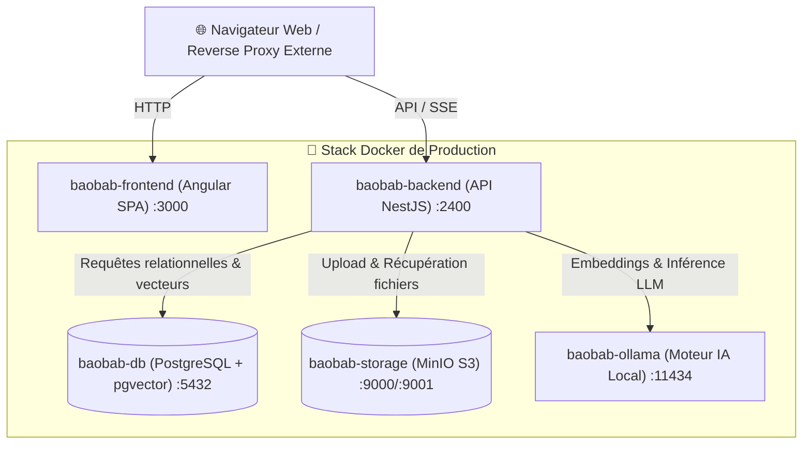

<div align="center">

# 🌳 Baobab

**Base de connaissances documentaire & intelligence artificielle auto-hébergeable et open-source.**  
*Une alternative légère, souveraine et locale à NotebookLM.*

<p align="center">
  <a href="README.fr.md">🇫🇷 <b>Lire en Français</b></a> •
  <a href="README.md">🇬🇧 <b>English</b></a>
</p>

[](https://github.com/GanaF4ll/baobab/actions/workflows/ci.yml)
[](docker/docker-compose.yml)
[](https://nestjs.com/)
[](https://angular.dev/)
[](https://orm.drizzle.team/)
[](https://github.com/pgvector/pgvector)
[](https://ollama.com/)
[](https://min.io/)

</div>

---

## 📖 Présentation

**Baobab** est une plateforme documentaire et base de connaissances auto-hébergée propulsée par des modèles de langage (LLM) et embeddings vectoriels locaux. Elle permet de téléverser des documents PDF et Markdown, de les organiser en espaces de travail (*workspaces*), de suivre l'historique des révisions avec un versionning granulaire, et de dialoguer en temps réel via un chat RAG (*Retrieval-Augmented Generation*) avec citations précises des sources.

Toutes vos données, documents, vecteurs et inférences IA restent **100% confinés sur votre infrastructure**.

---

## ✨ Fonctionnalités clés

- 🔐 **Confidentialité & Auto-hébergement** — Aucune API externe requise ; propulsé par Ollama exécuté localement.
- 📚 **Versionning documentaire** — Mettez à jour vos documents tout en conservant les versions précédentes avec possibilité de restauration immédiate.
- ⚡ **Chat RAG en streaming temps réel** — Réponses fluides générées mot par mot grâce aux Server-Sent Events (SSE) avec renvoi interactif vers les extraits sources.
- 🔍 **Recherche vectorielle via pgvector** — Recherche sémantique haute performance avec PostgreSQL + pgvector.
- 📦 **Stockage objet compatible S3** — Gestion des fichiers sécurisée et scalable via MinIO.
- 🏢 **Espaces de travail (Workspaces)** — Isolation et organisation des connaissances par projet ou équipe.
- 🛡️ **Stack épurée & non-contraignante** — Conteneurs indépendants sans reverse proxy imposé, vous laissant le choix total de votre infrastructure (Traefik, Nginx, Caddy, Cloudflare).

---

## 🏗️ Architecture technique



---

## 🚀 Démarrage rapide (Développement local)

### Prérequis

- [Docker](https://docs.docker.com/get-docker/) & Docker Compose
- [Node.js](https://nodejs.org/) (v22+)
- [pnpm](https://pnpm.io/) (v10+)

### 1. Cloner le projet

```bash
git clone https://github.com/GanaF4ll/baobab.git
cd baobab
```

### 2. Configurer l'environnement

```bash
cp .env.example .env.dev
```

### 3. Lancer la stack de développement

```bash
# Lancement de l'ensemble des conteneurs en mode dev
make dev-up
# Ou via pnpm :
pnpm run docker:up
```

Les services sont immédiatement disponibles sur :
- **Application Web (Frontend)** : `http://localhost:3000` (ou `http://localhost:4200` avec `ng serve`)
- **API Backend & Swagger** : `http://localhost:2400/swagger`
- **Console MinIO** : `http://localhost:9001`
- **Moteur Ollama** : `http://localhost:11434`

---

## 🚢 Déploiement en Production

### 1. Configurer l'environnement de production

Créez le fichier `.env` de production à partir du modèle :

```bash
cp .env.example .env
```

Éditez le fichier `.env` pour définir vos secrets de production :
- Définissez des mots de passe robustes pour `DB_PASSWORD` et `MINIO_ROOT_PASSWORD`.
- Générez une clé `JWT_SECRET` sécurisée (ex: `openssl rand -base64 48`).
- Choisissez le modèle LLM souhaité dans `OLLAMA_LLM_MODEL` (ex: `mistral:7b`, `qwen2.5:7b`, `llama3.2`).

### 2. Démarrer avec Docker Compose

```bash
# Compiler et démarrer tous les services de production en arrière-plan
make prod-up
# Ou avec docker compose directement :
docker compose -f docker/docker-compose.yml up -d --build
```

Exposition des services par défaut :
- **Application Web (Frontend)** : `http://ip-de-votre-serveur:3000/`
- **API Backend & Swagger** : `http://ip-de-votre-serveur:2400/swagger`
- **Console MinIO** : `http://ip-de-votre-serveur:9001`

---

## 🌐 Configuration d'un Reverse Proxy Externe (Optionnel)

Baobab n'imposant aucune couche de proxy interne, vous pouvez router le trafic avec le reverse proxy de votre choix (Nginx, Caddy, Traefik, NPM, Cloudflare Tunnel).

### Exemple Nginx (avec SSL et support du streaming SSE)

```nginx
server {
    listen 80;
    server_name baobab.example.com;
    return 301 https://$host$request_uri;
}

server {
    listen 443 ssl http2;
    server_name baobab.example.com;

    ssl_certificate /path/to/fullchain.pem;
    ssl_certificate_key /path/to/privkey.pem;

    client_max_body_size 50M;

    # Frontend SPA
    location / {
        proxy_pass http://localhost:3000;
        proxy_set_header Host $host;
        proxy_set_header X-Real-IP $remote_addr;
        proxy_set_header X-Forwarded-For $proxy_add_x_forwarded_for;
        proxy_set_header X-Forwarded-Proto $scheme;
    }

    # API Backend & Streaming SSE
    location ~ ^/(auth|conversations|documents|storage|trash|users|workspaces|swagger|swagger-json|health) {
        proxy_pass http://localhost:2400;
        proxy_http_version 1.1;
        proxy_set_header Upgrade $http_upgrade;
        proxy_set_header Connection "upgrade";
        proxy_set_header Host $host;
        proxy_set_header X-Real-IP $remote_addr;
        proxy_set_header X-Forwarded-For $proxy_add_x_forwarded_for;
        proxy_set_header X-Forwarded-Proto $scheme;

        # Désactivation du buffering pour le streaming SSE du LLM
        proxy_buffering off;
        proxy_cache off;
        proxy_read_timeout 3600s;
    }
}
```

### Exemple Caddy

```caddy
baobab.example.com {
    # Routes API backend
    @api path /auth/* /conversations/* /documents/* /storage/* /trash/* /users/* /workspaces/* /swagger* /health
    handle @api {
        reverse_proxy localhost:2400 {
            flush_interval -1
        }
    }

    # SPA Frontend fallback
    handle {
        reverse_proxy localhost:3000
    }
}
```

---

## ⚡ Accélération matérielle GPU pour Ollama (Optionnel)

Si votre serveur dispose d'un **GPU NVIDIA**, installez le [NVIDIA Container Toolkit](https://docs.nvidia.com/datacenter/cloud-native/container-toolkit/latest/install-guide.html) et ajoutez la directive `deploy` sur le service `baobab-ollama` dans `docker/docker-compose.yml` :

```yaml
services:
  baobab-ollama:
    deploy:
      resources:
        reservations:
          devices:
            - driver: nvidia
              count: all
              capabilities: [gpu]
```

---

## ⚙️ Référence des variables d'environnement

| Variable | Valeur par défaut | Description |
| :--- | :--- | :--- |
| `FRONTEND_PORT` | `3000` | Port hôte exposé pour l'application frontend Angular |
| `BACKEND_PORT` | `2400` | Port hôte exposé pour l'API NestJS |
| `DB_PORT` | `5432` | Port hôte exposé pour PostgreSQL |
| `DB_USER` | `baobab` | Nom d'utilisateur de la base de données PostgreSQL |
| `DB_PASSWORD` | - | **Requis** : Mot de passe PostgreSQL |
| `DB_NAME` | `baobab_db` | Nom de la base de données |
| `MINIO_ROOT_USER` | `baobab_admin` | Identifiant administrateur MinIO |
| `MINIO_ROOT_PASSWORD` | - | **Requis** : Mot de passe administrateur MinIO |
| `MINIO_BUCKET` | `baobab-bucket` | Nom du bucket S3 pour le stockage des fichiers |
| `MINIO_PORT` | `9000` | Port API S3 MinIO |
| `MINIO_CONSOLE_PORT`| `9001` | Port de la console Web MinIO |
| `OLLAMA_URL` | `http://baobab-ollama:11434` | URL du moteur Ollama (conteneur local ou serveur distant) |
| `OLLAMA_LLM_MODEL` | `mistral:7b` | Modèle LLM utilisé pour le chat et la synthèse RAG |
| `OLLAMA_EMBEDDING_MODEL`| `nomic-embed-text` | Modèle d'embeddings pour la vectorisation |
| `JWT_SECRET` | - | **Requis** : Clé secrète de signature des tokens JWT |
| `TZ` | `Europe/Paris` | Fuseau horaire du système et des conteneurs |

---

## 🛠️ Commandes CLI & Makefile

| Commande | Description |
| :--- | :--- |
| `make dev-up` | Démarre la stack de développement avec rechargement à chaud |
| `make dev-down` | Arrête et supprime les conteneurs de dev |
| `make dev-logs` | Affiche les logs en direct de tous les services de dev |
| `make prod-build` | Compile les images Docker de production optimisées |
| `make prod-up` | Démarre la stack de prod en arrière-plan avec migrations |
| `make prod-down` | Arrête la stack de production |
| `make prod-logs` | Affiche les logs de production |
| `make test` | Exécute la suite complète de tests (Backend & Frontend) |
| `make lint` | Vérifie le formatage et les règles de linting avec Biome |
| `make format` | Corrige et formate automatiquement le code avec Biome |
| `make db-migrate` | Applique les migrations Drizzle en attente |

---

## 🔄 Pipelines CI/CD

L'intégration et la livraison continues sont automatisées avec GitHub Actions :
- **Workflow CI (`.github/workflows/ci.yml`)** : Exécuté à chaque pull request et push pour valider la qualité du code (Biome), lancer les tests unitaires et valider les builds de production.
- **Workflow CD (`.github/workflows/docker-publish.yml`)** : Compile et publie automatiquement les images Docker multi-architectures sur le **GitHub Container Registry (GHCR)** lors des releases et push sur `main`.

---

## 📄 Licence

Ce projet est sous licence open-source. Consultez les en-têtes du dépôt pour plus d'informations.
