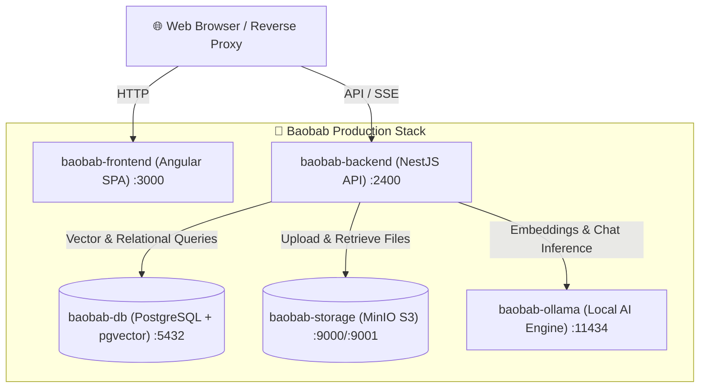

<div align="center">

# 🌳 Baobab

**Self-hostable, open-source AI knowledge base & document intelligence platform.**  
*A lightweight, privacy-first local alternative to NotebookLM.*

<p align="center">
  <a href="README.fr.md">🇫🇷 <b>Lire en Français</b></a> •
  <a href="README.md">🇬🇧 <b>English</b></a>
</p>

[](https://github.com/GanaF4ll/baobab/actions/workflows/ci.yml)
[](docker/docker-compose.yml)
[](https://nestjs.com/)
[](https://angular.dev/)
[](https://orm.drizzle.team/)
[](https://github.com/pgvector/pgvector)
[](https://ollama.com/)
[](https://min.io/)

</div>

---

## 📖 Overview

**Baobab** is a fully self-hosted document knowledge base powered by local Large Language Models (LLMs) and vector embeddings. It lets you upload PDF and Markdown documents, organize them in workspaces, track revision history with automated versioning, and interact with your knowledge base through real-time streaming RAG (Retrieval-Augmented Generation) chats with precision source citations.

All your data, embeddings, documents, and LLM inferences remain **100% on your own infrastructure**.

---

## ✨ Key Features

- 🔐 **Privacy-First & Self-Hosted** — No third-party AI APIs required; powered by Ollama running locally.
- 📚 **Document Versioning** — Upload updates to your documents while retaining previous versions, with instant rollback capabilities.
- ⚡ **Real-Time Streaming RAG** — Chat with your documents using Server-Sent Events (SSE) for instantaneous, token-by-token generation with interactive chunk citations.
- 🔍 **Vector Search via pgvector** — Efficient semantic similarity search with PostgreSQL + pgvector.
- 📦 **S3-Compatible Object Storage** — Reliable file storage backed by MinIO.
- 🏢 **Workspaces & Multi-Document Context** — Organize knowledge per team, project, or domain.
- 🛡️ **Clean & Unopinionated Stack** — Independent containers with no enforced proxy layer, giving you total freedom over your existing infrastructure (Traefik, Nginx, Caddy, Cloudflare).

---

## 🏗️ Architecture



---

## 🚀 Quickstart (Local Development)

### Prerequisites

- [Docker](https://docs.docker.com/get-docker/) & Docker Compose
- [Node.js](https://nodejs.org/) (v22+)
- [pnpm](https://pnpm.io/) (v10+)

### 1. Clone the repository

```bash
git clone https://github.com/GanaF4ll/baobab.git
cd baobab
```

### 2. Configure Environment

```bash
cp .env.example .env.dev
```

### 3. Start Development Stack

```bash
# Start all containers in development mode
make dev-up
# Or using pnpm:
pnpm run docker:up
```

The services will be accessible at:
- **Frontend SPA**: `http://localhost:3000` (or `http://localhost:4200` if running `ng serve`)
- **Backend API & Swagger**: `http://localhost:2400/swagger`
- **MinIO Console**: `http://localhost:9001`
- **Ollama API**: `http://localhost:11434`

---

## 🚢 Production Deployment

### 1. Setup Production Environment

Create your production `.env` file from the provided template:

```bash
cp .env.example .env
```

Edit `.env` to configure secure secrets:
- Set strong passwords for `DB_PASSWORD` and `MINIO_ROOT_PASSWORD`.
- Generate a secure `JWT_SECRET` (e.g. `openssl rand -base64 48`).
- Configure `OLLAMA_LLM_MODEL` (e.g. `mistral:7b`, `qwen2.5:7b`, `llama3.2`).

### 2. Launch with Docker Compose

```bash
# Build and start all production services in detached mode
make prod-up
# Or using docker compose directly:
docker compose -f docker/docker-compose.yml up -d --build
```

Default service exposure:
- **Frontend Web App**: `http://your-server-ip:3000/`
- **Backend API & Swagger**: `http://your-server-ip:2400/swagger`
- **MinIO Console**: `http://your-server-ip:9001`

---

## 🌐 External Reverse Proxy Configuration (Optional)

Because Baobab does not enforce any internal proxy, you can freely route traffic using your preferred reverse proxy (Nginx, Caddy, Traefik, NPM, Cloudflare Tunnel).

### Nginx Example (with SSL and SSE streaming support)

```nginx
server {
    listen 80;
    server_name baobab.example.com;
    return 301 https://$host$request_uri;
}

server {
    listen 443 ssl http2;
    server_name baobab.example.com;

    ssl_certificate /path/to/fullchain.pem;
    ssl_certificate_key /path/to/privkey.pem;

    client_max_body_size 50M;

    # Frontend SPA
    location / {
        proxy_pass http://localhost:3000;
        proxy_set_header Host $host;
        proxy_set_header X-Real-IP $remote_addr;
        proxy_set_header X-Forwarded-For $proxy_add_x_forwarded_for;
        proxy_set_header X-Forwarded-Proto $scheme;
    }

    # Backend API Endpoints & SSE Streaming
    location ~ ^/(auth|conversations|documents|storage|trash|users|workspaces|swagger|swagger-json|health) {
        proxy_pass http://localhost:2400;
        proxy_http_version 1.1;
        proxy_set_header Upgrade $http_upgrade;
        proxy_set_header Connection "upgrade";
        proxy_set_header Host $host;
        proxy_set_header X-Real-IP $remote_addr;
        proxy_set_header X-Forwarded-For $proxy_add_x_forwarded_for;
        proxy_set_header X-Forwarded-Proto $scheme;

        # Disable buffering for real-time LLM streaming responses
        proxy_buffering off;
        proxy_cache off;
        proxy_read_timeout 3600s;
    }
}
```

### Caddy Example

```caddy
baobab.example.com {
    # Backend API routes
    @api path /auth/* /conversations/* /documents/* /storage/* /trash/* /users/* /workspaces/* /swagger* /health
    handle @api {
        reverse_proxy localhost:2400 {
            flush_interval -1
        }
    }

    # Frontend SPA fallback
    handle {
        reverse_proxy localhost:3000
    }
}
```

---

## ⚡ GPU Acceleration for Ollama (Optional)

If your host has an **NVIDIA GPU**, install the [NVIDIA Container Toolkit](https://docs.nvidia.com/datacenter/cloud-native/container-toolkit/latest/install-guide.html) and add the `deploy` reservation to `baobab-ollama` in `docker/docker-compose.yml`:

```yaml
services:
  baobab-ollama:
    deploy:
      resources:
        reservations:
          devices:
            - driver: nvidia
              count: all
              capabilities: [gpu]
```

---

## ⚙️ Environment Variables Reference

| Variable | Default | Description |
| :--- | :--- | :--- |
| `FRONTEND_PORT` | `3000` | Host port mapped to the Angular frontend container |
| `BACKEND_PORT` | `2400` | Host port mapped to the NestJS backend API |
| `DB_PORT` | `5432` | Host port mapped to PostgreSQL |
| `DB_USER` | `baobab` | PostgreSQL database user |
| `DB_PASSWORD` | - | **Required**: PostgreSQL password |
| `DB_NAME` | `baobab_db` | PostgreSQL database name |
| `MINIO_ROOT_USER` | `baobab_admin` | MinIO root administrator username |
| `MINIO_ROOT_PASSWORD` | - | **Required**: MinIO root administrator password |
| `MINIO_BUCKET` | `baobab-bucket` | S3 bucket name for document files |
| `MINIO_PORT` | `9000` | MinIO S3 API port |
| `MINIO_CONSOLE_PORT`| `9001` | MinIO Web Management Console port |
| `OLLAMA_URL` | `http://baobab-ollama:11434` | URL to Ollama engine (internal container or remote server) |
| `OLLAMA_LLM_MODEL` | `mistral:7b` | LLM model used for chat generation |
| `OLLAMA_EMBEDDING_MODEL`| `nomic-embed-text` | Embedding model for semantic search |
| `JWT_SECRET` | - | **Required**: Secret key for signing JWT tokens |
| `TZ` | `Europe/Paris` | System and container timezone |

---

## 🛠️ CLI & Make Commands

| Command | Description |
| :--- | :--- |
| `make dev-up` | Start the local development stack with live reloading |
| `make dev-down` | Stop and remove development containers |
| `make dev-logs` | Stream logs from all development containers |
| `make prod-build` | Build optimized production Docker images |
| `make prod-up` | Start production stack in background with migrations |
| `make prod-down` | Stop production stack |
| `make prod-logs` | Stream production logs |
| `make test` | Run both backend (Jest) and frontend test suites |
| `make lint` | Run Biome linter across the entire monorepo |
| `make format` | Automatically format code with Biome |
| `make db-migrate` | Apply pending Drizzle database migrations |

---

## 🔄 CI/CD Pipelines

Continuous integration and delivery are automated via GitHub Actions:
- **CI Workflow (`.github/workflows/ci.yml`)**: Runs on every pull request and push to validate code quality (Biome linting), execute backend and frontend tests, and verify production builds.
- **CD Workflow (`.github/workflows/docker-publish.yml`)**: Builds and publishes multi-platform Docker images to **GitHub Container Registry (GHCR)** on releases and pushes to `main`.

---

## 📄 License

This project is open-source. See the repository headers and licenses for details.
